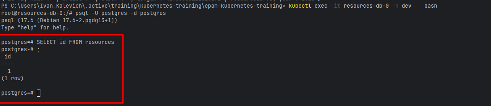

# microservices-intro
Microservices Intro program, pre-requisite for Kubernetes educational program: https://learn.epam.com/catalog/detailsPage?id=550944b4-72c9-4c2d-93ef-545b6e569f61

# TASK 1:

---
**---build project ---**

gradlew clean build\
docker build -t songs-service:latest ./songs-service\
docker build -t resource-service:latest ./resources-service

---
**---apply kubernetes config files---**

kubectl apply -f k8s

---
**---get all resources---**

kubectl get all -n dev\

---
**---create file in manual storage for songs-service through the first pod---**

kubectl exec -it songs-service-deployment-66bc4c4bf8-72chq -n dev -- sh -c "echo 'This is a persistence test file' > /app/data/persistence-test.txt"

---
**---check that the file was created successfully---**

kubectl exec -it songs-service-deployment-66bc4c4bf8-72chq -n dev -- cat /app/data/persistence-test.txt\

---
**---set the replicas' count to 1 for songs-service---**

kubectl scale deployment songs-service-deployment -n dev --replicas=1\

---
**---ensure that the number of pods for songs-services remains 1---**

kubectl get pods -n dev\

---
**---ensure that our file is still alive and has not been removed. Check it through the pod that remained after scaling.---**

kubectl exec -it songs-service-deployment-66bc4c4bf8-qdv2l -n dev -- cat /app/data/persistence-test.txt\

---
**---let's create resource through resource-service and ensure that we have no errors and resource-service interacts well with songs-service---**

kubectl port-forward service/resource-service 8080:8080 -n dev\
curl -X POST "http://localhost:8080/resources/file" -F "file=@resources/sample1.mp3"\

kubectl port-forward service/songs-service 8081:8081 -n dev\
curl -X POST "http://localhost:8080/resources/file" -F "file=@resources/sample1.mp3"\

---
kubectl port-forward service/songs-service 8081:8081 -n dev\
curl -X GET "http://localhost:8081/songs/1"\

---
**---go to resource-db/songs-db pods and check.---**

kubectl exec -it resources-db-0 -n dev -- bash\
psql -U postgres -d\
ELECT id FROM resources;\

kubectl exec -it songs-db-0 -n dev -- bash\
psql -U postgres -d postgres\
