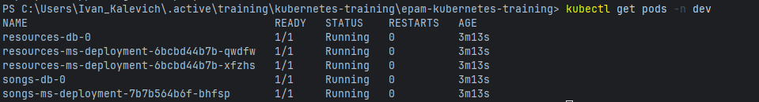

# microservices-intro
Microservices Intro program, pre-requisite for Kubernetes educational program: https://learn.epam.com/catalog/detailsPage?id=550944b4-72c9-4c2d-93ef-545b6e569f61

**---use docker from minikube---**
```
eval $(minikube docker-env --shell=bash)
```
---
**---build project ---**
```
./gradlew clean build
docker build -t songs-ms:latest songs-service/
docker build -t resources-ms:latest resources-service/
```
---
**---apply kubernetes config files---**
```
kubectl apply -f k8s/
```
---
**---get all resources---**
```
kubectl get all -n dev
```

---
**---create file in manual storage for songs-ms through the first pod---**

kubectl exec -it pod/songs-ms-deployment-7b7b564b6f-bhfsp -n dev -- sh -c "echo 'This is a persistence test file' > /app/data/persistence-test.txt"

---
**---check that the file was created successfully---**
```
kubectl exec -it pod/songs-ms-deployment-7b7b564b6f-bhfsp -n dev -- cat /app/data/persistence-test.txt
```


---
```
**---set the replicas' count to 1 for songs-ms---**
```
```
kubectl scale deployment songs-ms-deployment -n dev --replicas=1
```


---
**---ensure that the number of pods for songs-mss remains 1---**
```
kubectl get pods -n dev
```


---
**---ensure that our file is still alive and has not been removed. Check it through the pod that remained after scaling.---**
```
kubectl exec -it songs-ms-deployment-7b7b564b6f-bhfsp -n dev -- cat /app/data/persistence-test.txt
```


---
**---let's create resource through resources-ms and ensure that we have no errors and resources-ms interacts well with songs-ms---**
```
kubectl port-forward service/resources-ms 8080:8080 -n dev
curl -X POST "http://localhost:8080/resources/file" -F "file=@resources/sample1.mp3"
```


---
```
kubectl port-forward service/songs-ms 8081:8081 -n dev
curl -X GET "http://localhost:8081/songs/1"
```

kube
---
**---go to resource-db/songs-db pods and check.---**
```
kubectl exec -it resources-db-0 -n dev -- bash
psql -U postgres -d postgres
SELECT id FROM resources;
```

```
kubectl exec -it songs-db-0 -n dev -- bash
psql -U postgres -d postgres
SELECT * FROM songs;
```
